최근 수 년간 많은 pretrained 모델들이 다양한 downstream task들에서 활약하며 방대한 규모의, 논문에서 말하길 noisy internet-scale, dataset을 통한 pretraining 패러다임이 natural language processing 및 computer vision 분야에서 유효하다는 것이 증명됐다. 다만 이와 같은 방법론이 아직 널리 퍼지지 않은 분야가 있는데, 바로 로보틱스, 게이밍 및 컴퓨터 사용 등의 sequential decision 분야이다. 이에 대한 유인은 sequential decision과 관련된 data 그 자체는 풍부하나, 일례로 유튜브에 마인크래프트 플레이 영상이 얼마나 많을지 생각해보자, 그러한 data의 대부분이 직전 프레임에서 어떤 행동을 취해야 다음 프레임으로 넘어가는지에 대한 정보를 포함하고 있지 않음에 있다. 이런 경우 reinforcement learning을 사용할 수도 있겠지만 이는 상대적으로 sample inefficient 하거나 문제가 hard-exploration task인 경우 큰 비용이 요구될 수도 있다.

이에 이들은 pretraining 패러다임을 sequential decision 분야로 확장함과 동시에 난해한 방법론을 피하기 위해 작은 규모의 labeled data로 큰 규모의 unlabeled data를 충분한 정확도로 labeling할 수 있는 inverse dynamics model (IDM)을 제시한다. 동시에 이렇게 labeling된 대규모 dataset을 behavioral cloning을 통해 학습시킨 모델, foundation model, 의 zero-shot 성능 그리고 현시점에선 reinforcement learning만으론 풀 수 없는 hard-exploration task를 foundation 모델을 imitation 및 reinforcement learning으로 fine-tuning함으로써 해결할 수 있음을 마인크래프트 환경을 통해 보인다.

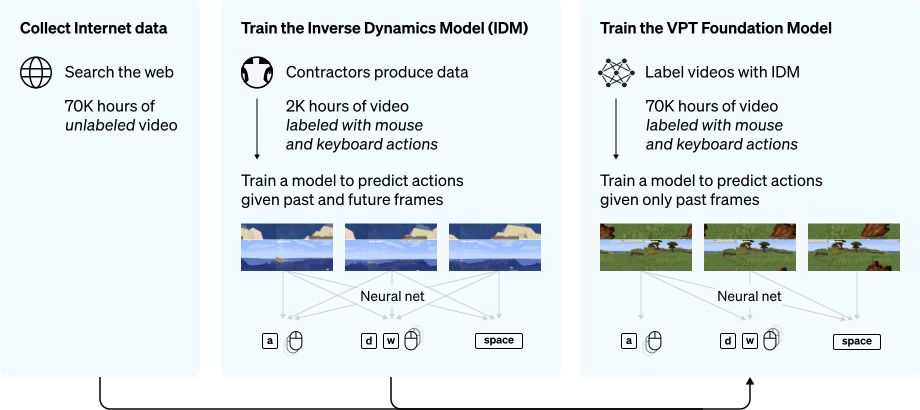

Fig. 1. VPT method overview [1]

## Inverse Dynamics Model (IDM)

상기했듯이 대다수의 data는 explicit action label을 포함하고 있지 않고, 따라서 현존하는 semi-supervised imitation learning 방법론들은 그러한 label 없이 학습하는 것을 목표로 하고 있다. 하지만 이 경우 환경을 탐색함에 있어 전적으로 policy에 의존하게 되고, 이는 exploration bottleneck이 발생할 시 policy가 절적한 행동을 학습할 수 없음을 의미한다.

이들은 이런 한계점을 피하기 위해 거대한 unlabeled dataset을 pseudo labeling한 뒤 이를 통해 sequential decision 분야에 pretraining 방법론을 적용하고자 한다. 이들은 이들의 실험이 앞선 실험들에 비해 큰 규모로, 즉 많은 양의 data 를 사용하여 진행되므로 텍스트와 같은 분야에서 이미 증명됐듯 간단한 방식임에도 좋은 성능을 이끌어낼 수 있을 것이라 가정한다.

이때 이들은 pseudo labeling을 위한 모델을 학습시킴에 있어 behavioral cloning을 사용하는 대신 inverse dynamics modeling이라는 방법을 제시한다. 그 이유로 만일 Behavioral cloning을 통해 학습한다면 이 task는 과거의 관측을 통해 미래의 behavior를 추론하는 causal modeling task로, 이는 과거와 미래의 관측값을 모두 알고 있는 상태에서 그 사이에 어떤 행동을 취해야하는지 추론하는 inverse dynamics modeling task에 비해 학습 난이도가 높으며 따라서 많은 양의 data를 요구할 수도 있기 때문이라고 말한다.

IDM은 대략 5 억 개의 학습가능한 가중치를 가진 모델로 128 개의 연속된 프레임을 입력으로 받으며 그 개략적인 구성은 다음과 같다. Temporal convolution layer, RestNet 기반의 image processing stack 그리고 키 입력과 마우스 움직임을 동시에 예측하는 residual unmasked attention layer. 저자들은 개중 첫 번째 구성요소인 temporal convolution layer의 중요성을 역설하는데, 이는 해당 layer가 시간축 정보를 통합해주는 역할을 한다는 점에서 이해할 수 있다. 물론 마지막 attention layer 또한 그 연산과정에 시간축을 활용하지만, 이를 단독으로 처리하는 동시에 temporal convolution layer를 포함했을 때와 비슷한 성능을 내려면 보다 크고 깊은 구성을 필요로하지 않을까 추측해본다.

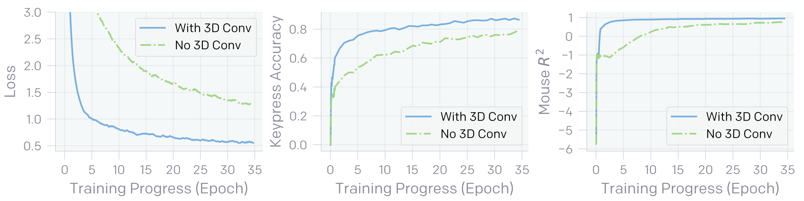

Fig. 2. IDM이 temporal convolution layer를 포함했을 때와 포함하지 않았을 때의 loss 및 성능 비교 [2]

마지막으로 pseudo labeling 과정을 살펴보면, 상기한 모델은 128 개의 연속된 프레임을 입력으로 받기 때문에 inference 단계에서도 당연히 128 개의 연속된 프레임을 입력 받는다. 다만 IDM의 진가는 non-causal한 objective로 학습했다는 점에 있고, 따라서 저자들은 시간축을 기준으로 sliding window 기법을 통해 예측값을 얻었으며 이때 stride로는 64 프레임을 사용한다. 또한 128 개의 프레임 중 32 번째부터 96 번째까지의 프레임에 대응되는 예측값만을 사용하여 영상의 처음과 마지막을 제외하곤 IDM 예측값의 경계 부분은 사용하지 않는다.

그 외 IDM의 자세한 구성과 학습 방법 등은 [논문](https://arxiv.org/abs/2206.11795)의 Appendix D에서 볼 수 있다.

### Performance

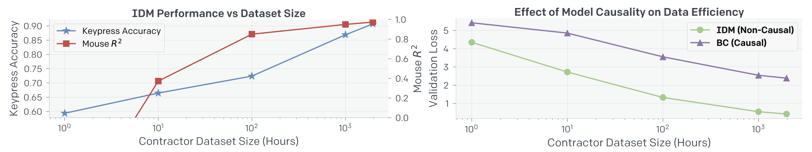

Fig. 3. 좌측은 IDM의 키 입력 및 마우스 위치의 정확도를 contractor dataset size에 대해 나타냈고 우측은 IDM과 BC를 마찬가지로 dataset size에 대해 비교한 것이다. [2]

저자들은 IDM을 1962 시간의 플레이 데이터에 학습시킨 결과 90.6%의 키 입력 정확도 그리고 마우스 움직임에서 0.97 \\(R^2\\)을 얻을 수 있었다. Fig. 3.의 좌측 그림에서 볼 수 있듯 IDM의 성능과 dataset의 크기는 여전히 양의 상관관계를 보이고 있지만, 1962 시간 이상으로 크기를 키우는 것은 효율이 떨어진다고 판단한 듯 보인다.

또한 BC와 IDM의 성능 비교를 통해 그들의 가정이 옳았음을 보였고, 같은 성능일 때 적어도 이 환경과 모델에선 BC가 대략 30 배 가까운 data를 필요로 한다는 것을 Fig. 3.의 우측 그림에서 확인할 수 있다.

## Data Filtering

이들은 인터넷에서 관련 키워드로 수집한 영상을 사용하기 전 플레이어의 얼굴, 채널 로고, 워터마크 등의 시각적 결함이나 PC 외의 플랫폼에서 플레이 된 영상 그리고 survival mode 외의 모드로 플레이된 영상 등을 제거하기 위해 data filtering 과정을 수행했다. 다만 충분히 많은 data, 충분히 큰 모델 그리고 충분한 연산능력이 뒷받침 된다면 해당 BC 모델 또한 이런 filtering 과정 없이도 깨끗한 마인크래프트 환경에서 잘 작동하리라 생각하지만, 간단함과 효율성을 위해 filtering 과정을 수행한다고 덧붙였다. 이 과정은 인터넷에서 수집한 영상에서 샘플링된 8800 개의 프레임을 학습한 모델이 수행한다.

어떤 키워드로 영상을 수집했는지 그리고 filtering 모델에 대한 보다 자세한 정보 등은 [논문](https://arxiv.org/abs/2206.11795)의 Appendix A에서 볼 수 있다.

## Video PreTraining (VPT)

### VPT Foundation Model Training and Zero-Shot Performance

수집된 27 만 시간 정도의 영상 중 위의 filtering 과정을 거쳐 7 만 시간 정도의 영상이 학습에 사용됐다. 또한 앞선 연구에 의해 제시된 5 억 파라미터, 30 epoch을 학습시켰으며 이는 720 개의 V100 GPU를 동원했을 때 9 일이 걸렸다고 한다. 이때 VPT의 training objective는 과거 관측값이 주어졌을 때 IDM에 의해 예측된 action에 대한 negative log-likelihood를 최소화하는 것으로 다음과 같이 쓸 수 있다. [2]

$$
\min_{\theta} \sum_{t \in \left [ 1...T \right ]} -\log \pi_{\theta}\left( a_t | o_1, ..., o_t \right), a_t \text{\textasciitilde} p_{\text{IDM}}\left( a_t | o_1, ..., o_t \right)
$$

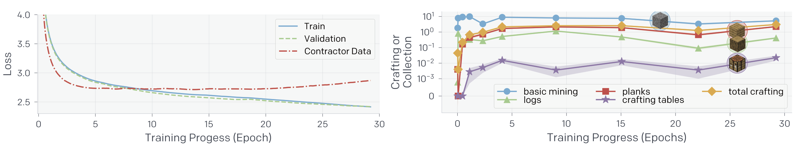

Fig. 4. 좌측은 IDM에 의해 pseudo labeling된 dataset에 대한 train 및 valid loss 그리고 GT인 contractor data에 대한 loss를 training epoch에 따라 나타낸 것이다. 우측은 각 아이템이 에피소드 당 몇 개 수집됐는지 2500 개 이상의 60 분 survival 에피소드를 평균내서 training epoch에 따라 나타낸 것이다. [2]

한 가지 특기할만한 점은 Fig. 4.의 좌측 그림에서 볼 수 있듯이 train, valid loss는 학습에 따라 꾸준히 감소하는 반면에 contractor data에 대한 loss는 7 epoch에서 최저값을 달성하고 반등한다는 점이다. 이는 그리 직관적인 현상은 아니라 저자들은 이에 대해 Appendix H에서 다음과 같이 실험 결과를 통해 설명한다.

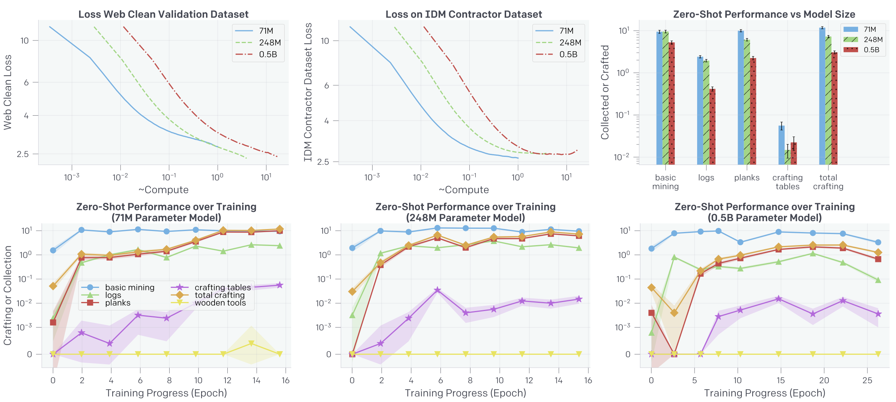

Fig. 5. Dataset과 모델 크기에 따른 loss 그리고 zero-shot 성능 [2]

우선 이들은 Fig.5.가 나타내듯 여러 크기의 모델을 실험해봤다. 재밌게도 가장 작은 모델이 가장 낮은 contractor dataset loss를 보임과 동시에 가장 높은 web clean dataset loss를 보인다. 유사하게 zero-shot 성능 또한 가장 작은 모델이 가장 높은 것을 볼 수 있다.

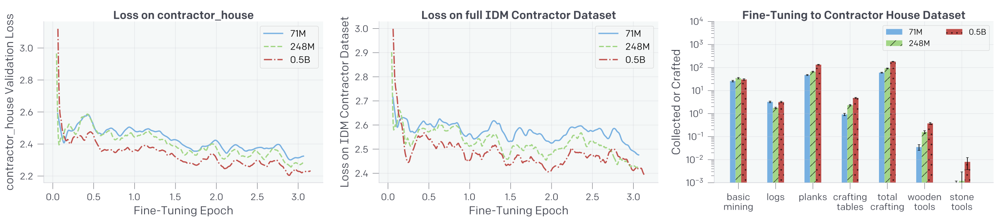

Fig. 6. Foundation 모델을 contractor_house dataset에 fine-tune함에 따른 loss 변화 [2]

하지만 해당 모델을 contractor_house라는 자체적인 게임 엔진에서 나온 dataset으로 fine-tuning하는 경우 이 순서가 단 몇 training step만에 바로 역전되는 것을 Fig. 6.에서 볼 수 있다. 저자들은 우선 가장 큰 모델이 contractor_house dataset에 대한 fine-tuning 이전에 높은 loss와 낮은 zero-shot 성능을 보이는 것은 web data의 특정 시각적 특이사항에 과도하게 집중함에 따라 나타나는 현상일 수 있다고 말한다. 동시에 단 몇 training step만에 그 순서가 역전되는 것은 그만큼 큰 모델이 data에 따라 더 나은 성능을 위해 빠르게 low level feature를 변환할 수 있기 때문이라고 말한다.

이를 필자 나름대로 해석을 덧붙여가며 이해해보자면 우선 모델의 크기가 클수록 보다 그만큼 성능이 좋으니, 혹은 비유하자면 해상도가 높으니, 미세한 특성에 집중하게될 가능성이 생기고 그에 따라 성능 하락을 불러올 수 있다는 것이다. 또한 그만큼 많은 특성을 다루고 있으니 새로운 data에 발맞춰 빠르게 low level feature를 변환할 수 있다는 것.

다만 이는 어디까지나 가설이고 완전히 검증된 것은 아니라고, not conclusive, 저자들도 말미에 덧붙이니 이 설명에 납득하거나 하지 않는 것은 결국 독자의 몫이라 할 수 있다.

VPT 학습에 대한 보다 자세한 정보는 [논문](https://arxiv.org/abs/2206.11795)의 Appendix H에서 확인할 수 있다.

### Fine-Tuning Performance

#### Behavioral Cloning (BC)

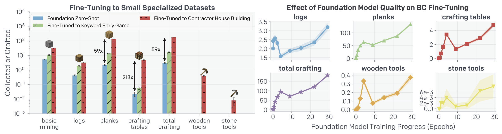

Fig. 7. 좌측은 foundation 모델의 zero-shot 성능 그리고 이를 earlygame_keyword 및 contractor_house dataset에 BC fine-tuning한 성능을 나타낸다. fine-tuning 후 foundation 모델은 하지 못했던 wooden, stone tools 제작이 가능해진 것을 볼 수 있다. 우측은 BC fine-tuning에 foundation 모델의 training 정도가 미치는 영향을 epoch에 대해 나타낸 것이다. [2]

Foundation 모델을 contractor_house dataset에 BC fine-tuning한 뒤 wooden tools 및 stone tools 제작이 가능해졌는데 이는 숙련된 마인크래프트 플레이어가 제작할 시 평균 1.2 분 (1390 action) 그리고 2.3 분 (2790 action)이 걸린다고 한다. 여기서 contractor_house dataset이란 contractor에게 약 10 분을 주고 그 안에 기초적인 집을 짓게 한 dataset인데, 이를 위해선 wood, sand 그리고 dirt가 필요하다고 한다. 따라서 우리는 왜 earlygame_keyword dataset은 위와 같은 새로운 특성을 가르치지 못했지만 contractor_house dataset은 가르칠 수 있었는지를 유추해 볼 수 있다.

한 가지 짚고 넘어갈만한 사항은 Fig. 4.의 우측 그림에서 볼 수 있듯 foundation 모델의 few-shot 성능은 training epoch에 따라 증가하지 않고 saturate되는 양상을 보이는데 반해 foundation 모델을 BC fine-tuning하는 경우 foundation 모델의 training epoch이 증가함에 따라 그 성능이 따라 증가한다는 것이다.

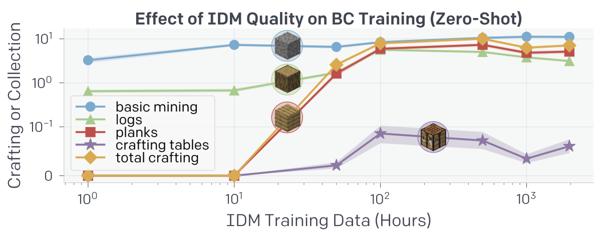

Fig. 8. IDM 품질의 영향은 IDM trainig data의 크기가 100 시간을 넘긴 이후론 크지 않다는 것을 볼 수 있다. [2]

#### Reinforcement Learning (RL)

RL fine-tuning의 경우 학습에 앞서 reward shaping이 수행됐다. 자세한 정보는 [논문](https://arxiv.org/abs/2206.11795)의 Appendix G에서 볼 수 있다.

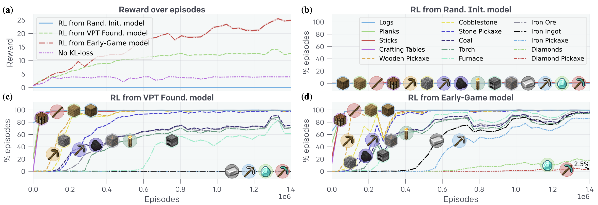

Fig. 9. (a) Episode에 따른 reward. 모델이 random initialize된 경우 그 어떤 reward도 얻지 못함을 볼 수 있다. (b) 모델이 random initialize된 경우 그 어떤 요소도 수집하거나 제작하지 못한다. (c) Foundation 모델을 RL fine-tuning한 경우. (d) Foundation 모델을 위의 earlygame_keyword에 fine-tuning한 뒤 RL fine-tuning한 경우 (c)에서 습득하거나 제작하지 못했던 나머지 것들을 수집 및 제작할 수 있게 됐다. [2]

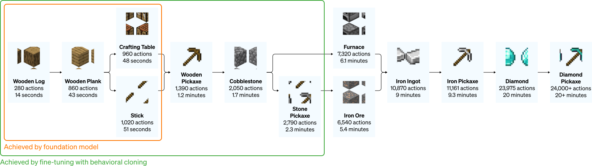

Fig. 10. Diamond pickaxe 제작 과정 [1]

Foundation 모델 \\(\rightarrow\\) Early-Game 모델 \\(\rightarrow\\) RL fine-tuned 순으로 학습된 모델의 경우 놀라운 성능을 보여준다.  해당 모델은 iron pickaxe를 제작할 확률이 80%, diamond를 수집할 확률이 20% 그리고 diamond pickaxe를 제작할 확률이 2.5% 가량 되는데, 이는 사람이 diamond pickaxe를 제작하는 것을 목표로 하고 플레이 했을 때 각 아이템을 수집, 제작할 확률 57%, 15%, 12%와 비견될만한 수치이다.

## Data Scaling Properties

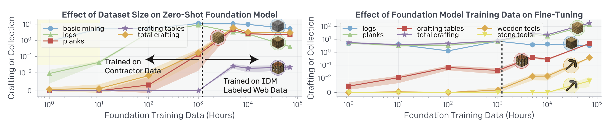

Fig. 11. Foundation 모델의 zero-shot 성능은 어느순간 정체되는 것을 볼 수 있는 반면 fine-tuning하는 경우 training data의 크기가 증가함에 따라 그 성능 또한 향상되는 것을 볼 수 있다. [2]

## Conclusion

이들은 이번 실험을 통해 풍부한 unlabeled data를 sequential decision 분야에서 어떻게 사용하는 좋을지에 대해 하나의 방법을 제시했다고 자평한다. 또한 generative video modeling 혹은 contrastive method들이 representational prior만을 만들어내는데 반해 VPT는 어떻게 행동하면 되는지를 pretraining 단계에서 직접적으로 학습할 수 있게 하고 이는 이후 RL fine-tuning 단계에서 매우 효과적인 exploration prior를 제공한다고 한다.

다만 현재 단계에서는 모델이 단지 과거의 관측값에 따라 행동할 뿐, 어떤 목표를 가지고 행동할지 설정할 순 없다. 이를 더 많은 data, 더 큰 모델로 학습하는 것과 더불어 향후의 과제로 남겨뒀다.

## 여담

매우 생소한 방법론을 제시했다거나 한 연구는 아니었지만, 그 뛰어난 인력과 자본력을 동원해 일반적으로 확인하기 어려운 영역을 탐구하고, 놀랄만한 결과를 냈다는 점에서 역시 OpenAI다 하며 읽었다. 다만 읽는 내내 이들이 conclusion에서 말했듯 모델에 목표를 설정할 수 있다면 좋을텐데라는 생각을 했는데, 향후 연구에서 어떻게 목표를 설정할지 그리고 설정했을 시 어느정도 정확도로 이를 달성할 수 있을지 등 향후 연구가 기다려지는 논문이었다.

참고로 이 연구에 쓰인 모델 weight 등은 공개되어 있으니 관심있는 독자는 [VPT GitHub](https://github.com/openai/Video-Pre-Training)를 참고 바란다.

## References

[1] https://openai.com/blog/vpt

[2] Baker et al. "[Video PreTraining (VPT): Learning to Act by Watching Unlabeled Online Videos](https://arxiv.org/abs/2206.11795)" (2022).

