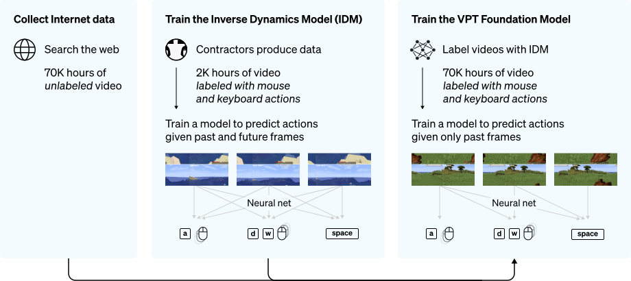
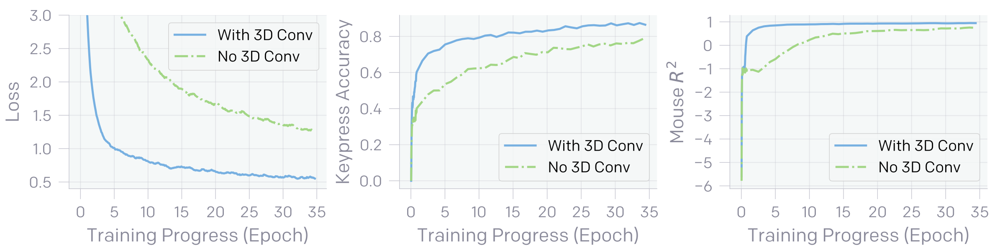
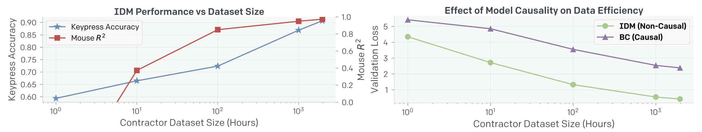

최근 수 년간 많은 pretrained 모델들이 다양한 downstream task들에서 활약하며 방대한 규모의, 논문에서 말하길 noisy internet-scale, dataset을 통한 pretraining 패러다임이 natural language processing 및 computer vision 분야에서 유효하다는 것이 증명됐다. 다만 이와 같은 방법론이 아직 널리 퍼지지 않은 분야가 있는데, 바로 로보틱스, 게이밍 및 컴퓨터 사용 등의 sequential decision 분야이다. 이에 대한 유인은 sequential decision과 관련된 data 그 자체는 풍부하나, 일례로 유튜브에 마인크래프트 플레이 영상이 얼마나 많을지 생각해보자, 그러한 data의 대부분이 직전 프레임에서 어떤 행동을 취해야 다음 프레임으로 넘어가는지에 대한 정보를 포함하고 있지 않음에 있다. 이런 경우 reinforcement learning을 사용할 수도 있겠지만 이는 상대적으로 sample inefficient 하거나 문제가 hard-exploration task인 경우 큰 비용이 요구될 수도 있다.

이에 저자들은 pretraining 패러다임을 sequential decision 분야로 확장함과 동시에 난해한 방법론을 피하기 위해 작은 규모의 labeled data로 큰 규모의 unlabeled data를 충분한 정확도로 labeling할 수 있는 inverse dynamics model (IDM)을 제시한다. 동시에 이렇게 labeling된 대규모 dataset을 behavioral cloning을 통해 학습시킨 모델, foundation model, 의 zero-shot 성능 그리고 현시점에선 reinforcement learning만으론 풀 수 없는 hard-exploration task를 foundation 모델을 imitation 및 reinforcement learning으로 fine-tuning함으로써 해결할 수 있음을 마인크래프트 환경을 통해 보인다.

Fig. 1. VPT method overview [1]

## Inverse Dynamics Model (IDM)

상기했듯이 대다수의 data는 explicit action label을 포함하고 있지 않고, 따라서 현존하는 semi-supervised imitation learning 방법론들은 그러한 label 없이 학습하는 것을 목표로 하고 있다. 하지만 이 경우 환경을 탐색함에 있어 전적으로 policy에 의존하게 되고, 이는 exploration bottleneck이 발생할 시 policy가 절적한 행동을 학습할 수 없음을 의미한다.

저자들은 이런 한계점을 피하기 위해 거대한 unlabeled dataset을 pseudo labeling한 뒤 이를 통해 sequential decision 분야에 pretraining 방법론을 적용하고자 한다. 이들은 이들의 실험이 앞선 실험들에 비해 큰 규모로, 즉 많은 양의 data 를 사용하여 진행되므로 텍스트와 같은 분야에서 이미 증명됐듯 간단한 방식임에도 좋은 성능을 이끌어낼 수 있을 것이라 가정한다.

이때 저자들은 pseudo labeling을 위한 모델을 학습시킴에 있어 behavioral cloning을 사용하는 대신 inverse dynamics modeling이라는 방법을 제시한다. 그 이유로 만일 Behavioral cloning을 통해 학습한다면 이 task는 과거의 관측을 통해 미래의 behavior를 추론하는 causal modeling task로, 과거와 미래의 관측값을 모두 알고 있는 상태에서 그 사이에 어떤 행동을 취해야하는지 추론하는 inverse dynamics modeling task에 비해 학습 난이도가 높으며 따라서 많은 양의 data를 요구할 수도 있기 때문이라고 설명한다.

IDM은 대략 5 억 개의 학습가능한 가중치를 가진 모델로 128 개의 연속된 프레임을 입력으로 받으며 그 개략적인 구성은 다음과 같다. Temporal convolution layer, RestNet 기반의 image processing stack 그리고 키 입력과 마우스 움직임을 동시에 예측하는 residual unmasked attention layer. 저자들은 개중 첫 번째 구성요소인 temporal convolution layer의 중요성을 역설하는데, 이는 해당 layer가 시간축 정보를 통합해주는 역할을 한다는 점에서 이해할 수 있다. 물론 마지막 attention layer 또한 그 연산과정에 시간축을 활용하지만, 이를 단독으로 처리하는 동시에 temporal convolution layer를 포함했을 때와 비슷한 성능을 내려면 보다 크고 깊은 구성을 필요로하지 않을까 추측해본다.

Fig. 2. IDM이 temporal convolution layer를 포함했을 때와 포함하지 않았을 때의 loss 및 성능 비교 [2]

마지막으로 pseudo labeling 과정을 살펴보면, 상기한 모델은 128 개의 연속된 프레임을 입력으로 받기 때문에 inference 단계에서도 당연히 128 개의 연속된 프레임을 입력 받는다. 다만 IDM의 진가는 non-causal한 objective로 학습했다는 점에 있고, 따라서 저자들은 시간축을 기준으로 sliding window 기법을 통해 예측값을 얻었으며 이때 stride로는 64 프레임을 사용했다. 또한 128 개의 프레임 중 32 번째부터 96 번째까지의 프레임에 대응되는 예측값만을 사용하여 영상의 처음과 마지막을 제외하곤 IDM 예측값의 경계 부분은 사용하지 않았다.

그 외 IDM의 자세한 구성과 학습 방법 등은 논문의 Appendix D에서 볼 수 있다.

### Performance

Fig. 3. 좌측은 IDM의 키 입력 및 마우스 위치의 정확도를 contractor dataset size에 대해 나타냈고 우측은 IDM과 BC를 마찬가지로 dataset size에 대해 비교한 것이다. [2]

## Video PreTraining (VPT)

Using pseudo-labels generated from the IDM, we then train a model to mimic the distribution of behavior in the previously unlabeled dataset with standard behavioral cloning at scale, which does not require any model rollouts and thus does not suffer from any potential exploration bottlenecks in the environment. Finally, we show we can fine-tune this model to downstream tasks with either behavioral cloning or RL.

### Zero-Shot Performance

### Fine-Tuning Performance

#### Behavioral Cloning (BC)

#### Reinforcement Learning (RL)

## References

[1] https://openai.com/blog/vpt

[2] Baker et al. "[Video PreTraining (VPT): Learning to Act by Watching Unlabeled Online Videos](https://arxiv.org/abs/2206.11795)" (2022).
