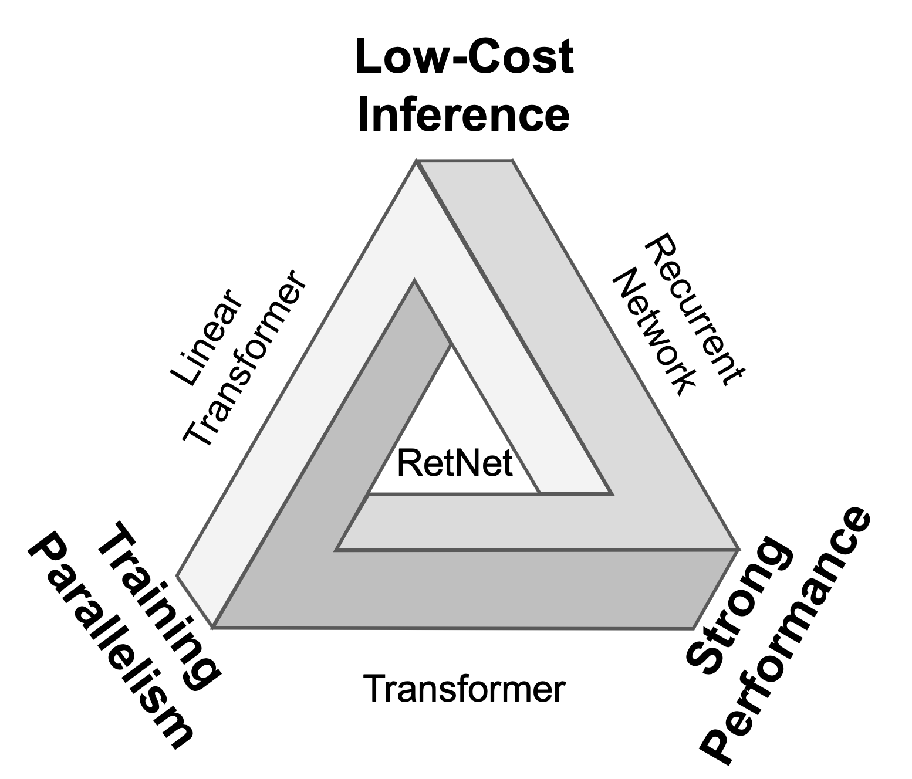
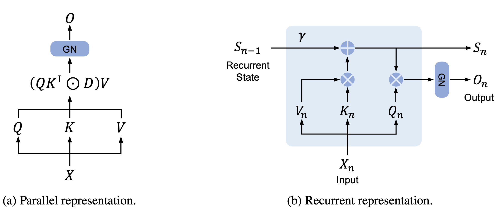
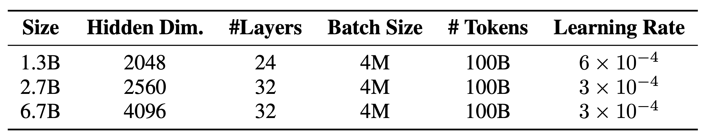
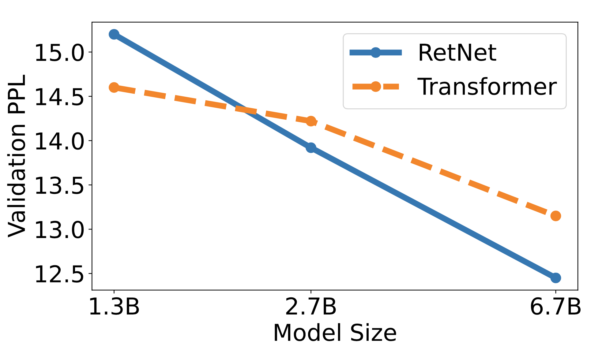
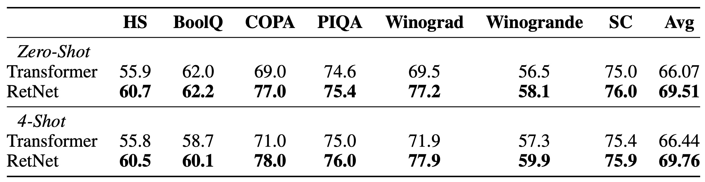
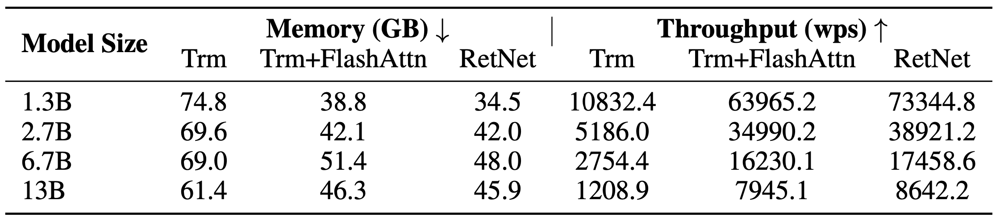
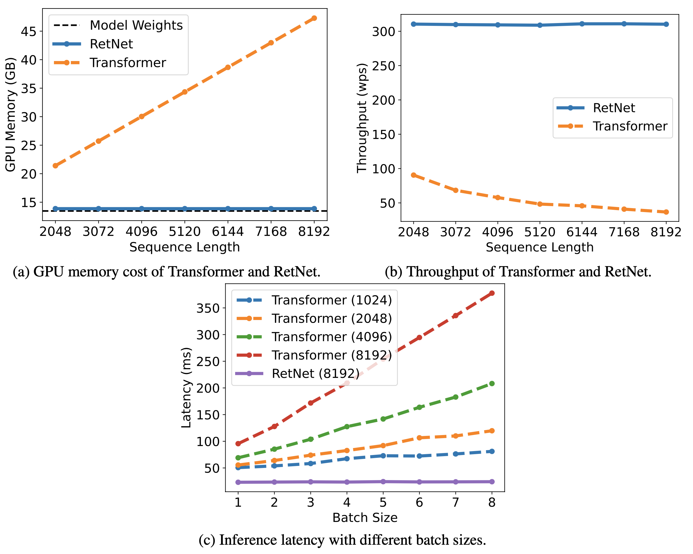
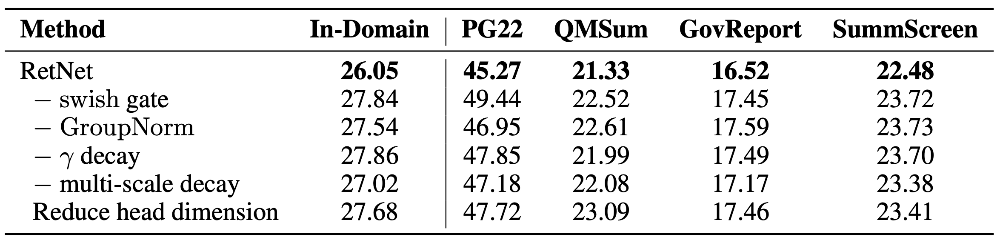

트랜스포머 아키텍쳐가 2017년에 등장한 이후 다양한 영역에서 그 유용성을 입증했고 따라서 현대 딥러닝 아키텍쳐의 표준으로 자리매김 했다 해도 과언이 아닐 것이라 생각합니다. 다만 그런 트랜스포머 아키텍쳐 (혹은 어텐션 메커니즘)에도 단점은 있으니, 바로 높은 코스트입니다. 특히 트랜스포머의 parallelism은 학습시엔 유용하지만 이를 추론 때 역시 강제하여 시퀀스 길이에 quadratic한 자원을 요구하게 합니다.

Fig. 1. "Impossible triangle". RetNet(Retentive Network)은 불가능을 가능케 합니다. [1]

이를 극복하기 위해 연구진은 두 가지 표현 방식(recurrent, parallel)을 취할 수 있는 retention mechanism을 제안합니다. 동시에 이 메커니즘에 대한 그들의 자신감을 Fig. 1과 함께 Arthur C. Clarke의 문구를 인용하여 표현하는데, 과연 가슴 설레는 문구가 아닐 수 없습니다.

    <blockquote>
        "The only way to discover the limits of the possible is to go beyond them into the impossible."
        <figcaption>
            &mdash; <cite>Arthur C. Clark</cite>
        </figcaption>
    </blockquote>

## Retentive Network

RetNet은 트랜스포머와 비슷하게 동일한 *L*개의 블럭이 쌓인 형태로 구성되어 있고, 각 블럭은 multi-scale retention (MSR) 모듈과 feed-forward network (FFN) 모듈로 이루어져 있습니다. RetNet은 주어진 인풋 시퀀스를 autoregressive하게 인코딩하는데, 그 과정은 다음과 같습니다.
$$
\begin{align}
X^0 = \left [ \boldsymbol x_0, \cdots , \boldsymbol x_{\lvert x \rvert} \right ] \in \mathbb{R}^{\lvert x \rvert \times d_\text{model}}
\end{align}
$$

$$
\begin{align}
X^l = \text{RetNet}_l \left ( X^{l-1} \right ),\ l \in \left [ 1, L \right ]
\end{align}
$$

이 또한 트랜스포머와 유사한데, 인풋 시퀀스 \\(x = x_1 \cdots x_{\lvert x \rvert}\\)를 (1) 시퀀스를 임베딩 벡터로 변환해주고, (2) 이전 블럭의 아웃풋을 이후 블럭의 인풋으로 사용하는 것의 반복입니다.

> **들어가기에 앞서**
>
> 아래 나오는 \\( V_n, O_n \\) 등은 실제론 벡터로, 논문에서도 설명의 간편함을 위해 스칼라 사이의 mapping으로 설명하고 있습니다. 또한 논문에선 이를 구분하기 위해 소문자 표현을 사용했지만 저는 다음 규칙에 맞춰 작성하겠습니다.
>
> |         Matrix         |            Vector             |  Scalar   |
> | :--------------------: | :---------------------------: | :-------: |
> | \\( \boldsymbol{A} \\) | \\( \vec {\boldsymbol{A}} \\) | \\( A \\) |

### Retention

Fig. 2. RetNet의 dual form.

Retention mechanism의 가장 큰 특징은 두 가지 표현 방식을 가지는 것으로, 학습시엔 parallelism의 이점을, 추론시엔 RNN으로서의 이점을 활용합니다. 이를 위해 연구진은 어떤 recurrent state \\( \vec {\boldsymbol S}_n \\)을 사용하여 \\( V_n \mapsto O_n \\)의 sequence modelling problem을 고려합니다. 당장 \\( V_n, O_n \\)등이 뜻하는 바가 뭔지 궁금하신 분들도 계시겠지만 이는 잠깐동안 미뤄놓겠습니다. 연구진은 recurrent state \\( \vec {\boldsymbol S}_n \\)과 \\( O_n \\)으로의 mapping을 다음과 같이 정의했습니다.

$$
\begin{align}
\vec {\boldsymbol S_n} = \boldsymbol{A} \vec {\boldsymbol S}_{n-1} + \vec {\boldsymbol K}_n V_n
\end{align}
$$

$$
\begin{align}
O_n = \vec {\boldsymbol Q}_n \cdot \vec {\boldsymbol S}_n
\end{align}
$$

이때 \\( \vec {\boldsymbol Q}_n, \vec {\boldsymbol K}_n, V_n \\)는 아래와 같습니다. \\( V_n \\)이 스칼라라는 것만 제외하면 익숙한 형태입니다. 참고로 "들어가기에 앞서"에 설명했듯 이는 설명의 간편함을 위한 것으로, 실제 모델에선  \\( \vec {\boldsymbol V}_n \\) 또한 벡터고 \\({\boldsymbol W}_V\\)도 매트릭스 입니다.
$$
\begin{align}
\vec {\boldsymbol Q}_n &= \vec {\boldsymbol X}_n {\boldsymbol W}_Q \\\
\vec {\boldsymbol K}_n &= \vec {\boldsymbol X}_n {\boldsymbol W}_K \\\
V_n &= \vec {\boldsymbol X}_n \cdot \vec {\boldsymbol W}_V
\end{align}
$$

다시 위로 돌아가서 식 (4)에 식 (3)을 대입해 \\( O_n \\)을 \\( \vec {\boldsymbol S}_i \\) 없이 표현할 수 있는지 보겠습니다.

$$
\begin{align}
O_n &= \vec {\boldsymbol Q}_n \cdot \vec {\boldsymbol S}_n \\\
&= \vec {\boldsymbol Q}_n \cdot \left ( \boldsymbol{A} \vec {\boldsymbol S}\_{n-1} + \vec {\boldsymbol K}_n V_n \right ) \\\
&= \vec {\boldsymbol Q}_n \cdot \left (
\boldsymbol{A} \left (
\boldsymbol{A} \vec {\boldsymbol S}\_{n-2} + \vec {\boldsymbol K}\_{n-1} V\_{n-1}
\right ) + \vec {\boldsymbol K}_n V_n
\right ) \\\
&= \vec {\boldsymbol Q}_n \cdot
\left (
{\boldsymbol A}^n \vec {\boldsymbol S}_0 +
\sum^n\_{m=1} {\boldsymbol A}^{n-m} \vec {\boldsymbol K}_m V_m
\right )
\end{align}
$$

만약  \\( \vec {\boldsymbol S}_0 = \vec 0 \\)이라면 식 (11)에서 state항을 없앨 수 있고, 논문에서 이를 명시적으로 서술하진 않지만 식 (12)에 해당하는 수식만 적혀있는걸 보면  \\( \vec {\boldsymbol S}_0 \\)는 \\( \vec 0 \\)으로 초기화된다고 추측할 수 있습니다.

$$
\begin{align}
O_n = \vec {\boldsymbol Q}_n \cdot \sum^n\_{m=1} {\boldsymbol A}^{n-m} \vec {\boldsymbol K}_m V_m
\end{align}
$$

여기서 더 나아가 \\(  \boldsymbol{A} \\)를 대각화 해주면  \\( \boldsymbol{A} = \boldsymbol{\Lambda}\left ( \vec {\boldsymbol{\gamma}} e^{i \vec {\boldsymbol \theta}} \right ) \boldsymbol{\Lambda}^{-1} \\)로 표현할 수 있고,  \\( \boldsymbol{A}^{n-m} \\)은 다음과 같습니다.

$$
\begin{align}
\boldsymbol{A}^{n-m} = \boldsymbol{\Lambda}\left (
\vec {\boldsymbol{\gamma}} e^{i \vec {\boldsymbol \theta}}
\right )^{n-m} \boldsymbol{\Lambda}^{-1}
\end{align}
$$

이제 식 (13)을 식 (12)에 대입하여 정리해보겠습니다.

$$
\begin{align}
O_n &= \sum^n\_{m=1}
\vec {\boldsymbol Q}_n \cdot \boldsymbol{\Lambda}\left (
\vec {\boldsymbol{\gamma}} e^{i \vec {\boldsymbol \theta}}
\right )^{n-m} \boldsymbol{\Lambda}^{-1} \vec {\boldsymbol K}_m V_m \\\
&= \sum^n\_{m=1}
\vec {\boldsymbol Q}^{\prime}_n \cdot \left (
\vec {\boldsymbol{\gamma}} e^{i \vec {\boldsymbol \theta}}
\right )^{n-m} \vec {\boldsymbol K}^{\prime}_m V_m \\\
&= \sum^n\_{m=1}
\left (
\vec {\boldsymbol Q}^{\prime}_n
\left ( \vec {\boldsymbol{\gamma}} e^{i \vec {\boldsymbol \theta}} \right )^n
\right )
\cdot
\left (
\left ( \vec {\boldsymbol{\gamma}} e^{i \vec {\boldsymbol \theta}} \right )^{-m}
\vec {\boldsymbol K}^{\prime}_m
\right )
V_m
\end{align}
$$

\\( {\boldsymbol W}_Q, {\boldsymbol W}_K \\)가 학습 가능한 파라미터라는 점과 \\( \boldsymbol{\Lambda} \\)가 인풋으로부터 독립적인 값이라는 점을 고려해 프라임 표시를 떼고, \\( \vec {\boldsymbol \gamma} \\)를 scalar로 reduce하면 \\( O_n \\)은 다음과 같아집니다.

$$
\begin{align}
O_n = \sum^n\_{m=1}
\gamma^{n-m}
\left (
\vec {\boldsymbol Q}_n e^{i n \vec {\boldsymbol \theta}}
\right )
\cdot
\left (
\vec {\boldsymbol K}_m e^{i m \vec {\boldsymbol \theta}}
\right )^\dagger
V_m
\end{align}
$$

\\( \vec {\boldsymbol Q}_n e^{i n \vec {\boldsymbol \theta}}, \vec {\boldsymbol K}_m e^{i m \vec {\boldsymbol \theta}} \\)는 xPos [2]의 형태로, 생긴대로 시퀀스 상에서의 위치 정보를 포함하고 있으며, relative position embedding의 일종으로 해석될 수 있습니다. 또한 식 (17)은 쉽게 parallelizable한 형태를 띄고 있으며, 이는 식 (4)의 recurrent한 형태와 함께  \\( O_n\\)이 두 가지 방식으로 계산될 수 있다는 것을 보여줍니다.

이제 \\( O_n\\)을 attention score와 유사한 역할을 하는 어떤 값이라고 생각해보면, retention mechanism은 이 값을 학습시엔 트랜스포머처럼 병렬적으로 계산하지만 추론시엔 같은 파라미터를 이용함에도 recurrent하게 계산할 수 있어 quadratic한 코스트를 linear하게 줄일 수 있도록 하는 메커니즘이라고 할 수 있습니다.

#### Chunkwise Recurrent Representation

앞서 recurrent, parallel representation을 살펴봤는데 연구진은 여기서 그치지 않고 그 둘의 표현법을 섞어 활용하기도 했습니다. 우선 \\( \vec{\boldsymbol R}_n =  \sum^n\_{m=1} \gamma^{n-m} \left ( \vec {\boldsymbol K}_m e^{i m \vec {\boldsymbol \theta}} \right )^\dagger V_m \\)이라고 정의하면 식 (17)을 다음과 \\(b\\)의 길이만큼 잘라서 표현할 수 있습니다.

$$
\vec{\boldsymbol R}_n =
\sum^n\_{m=b} \gamma^{n-m} \left (
\vec {\boldsymbol K}_m e^{i m \vec {\boldsymbol \theta}}
\right )^\dagger V_m
+
\gamma^b \vec{\boldsymbol R}\_{n-b}
$$

즉, 각각의 chunk는 그대로 식 (17) 혹은 식 (19)의 inner-chunk와 같이 계산하고, chunk들 사이의 정보는 아래 식 (19)의 cross-chunk와 같이 계산할 수 있습니다. 이를 통해 연구진은 매우 긴 시퀀스도 일정한 길이의 chunk로 잘라 계산함으로써 학습 효율을 높일 수 있었다고 합니다.

$$
\begin{align}
O_n &= \vec {\boldsymbol Q}_n e^{i n \vec {\boldsymbol \theta}} \cdot \vec{\boldsymbol R}_n \\\
&= \underbrace{\sum^n\_{m=b} \gamma^{n-m}
\left ( \vec {\boldsymbol Q}_n e^{i n \vec {\boldsymbol \theta}} \right )
\cdot
\left ( \vec {\boldsymbol K}_m e^{i m \vec {\boldsymbol \theta}} \right )^\dagger V_m
}\_\text{Inner-Chunk}
+
\overbrace{\gamma^b \vec {\boldsymbol Q}_n e^{i n \vec {\boldsymbol \theta}} \cdot \vec{\boldsymbol R}\_{n-b}
}^\text{Cross-Chunk}
\end{align}
$$

### Gated Multi-Scale Retention

Multi-Scale Retention (MSR) 또한 Multi-Head Attention (MHA)과 유사하게 \\(d_\text{model}\\) 차원을 헤드의 차원 \\( d \\)로 나눠 여러 헤드를 사용했습니다. 각 헤드는 서로 다른 \\( {\boldsymbol W}_Q, {\boldsymbol W}_K, {\boldsymbol W}_V \in \mathbb{R}^{d \times d} \\) 파라미터를 가지며 각 헤드의 \\( \gamma \\)는 다르지만, 레이어 별로는 동일합니다. 또한 비선형성을 증가시키기 위해 swish gate를 추가하였다고 합니다.

$$
\begin{align}
\gamma &= 1 - 2^{-5-\text{arange}(0, h)} \in \mathbb R^h \\\
\text{head}_i &= \text{Retention}(\boldsymbol X, \gamma_i ) \\\
Y &= \text{GroupNorm}_h (\text{Concat}(\text{head}_1, \cdots, \text{head}_h)) \\\
MSR(\boldsymbol X) &= (\text{swish}({\boldsymbol X} {\boldsymbol W}_G) \odot Y) {\boldsymbol W}_O
\end{align}
$$

이때 \\( {\boldsymbol W}_G, {\boldsymbol W}_O \in \mathbb{R}^{d\_\text{model} \times d\_\text{model}} \\) 역시 학습가능한 파라미터입니다.

이외에도 Normalization 기법이나 pseudocode 등의 내용 또한 있으니 이런 보다 디테일한 사항이 궁금하신 분은 논문을 참고하시길 바랍니다.

 

### Overall Architecture of Retention Networks

$$
\begin{align}
{\boldsymbol Y}^l &= \text{MSR}(\text{LN}({\boldsymbol X}^l)) + {\boldsymbol X}^l \\\
{\boldsymbol X}^{l+1} &= \text{FFN}(\text{LN}({\boldsymbol Y}^l)) + {\boldsymbol Y}^l
\end{align}
$$

이때 \\( \text{FFN}({\boldsymbol X}) = \text{gelu}({\boldsymbol X}{\boldsymbol W}_1) {\boldsymbol W}_2 \\)의 일반적인 형태입니다.

## Experiments

대망의 성능을 볼 차례가 되었습니다. 디테일한 사항은 논문에 남겨두고, 간략하게 살펴보도록 하겠습니다.

Table. 1. 크기와 학습 하이퍼 파라미터

Fig. 3. 모델 사이즈에 따른 perplexity 추이.

Table. 2. 6.7B 모델의 *Zero-Shot, 4-Shot* 성능

Table. 3. 크기별 학습 코스트. 추론 뿐만 아니라 학습시에도 트랜스포머 대비 효율적임을 볼 수 있습니다.

Fig. 4. 추론 코스트. Recurrent한 형태로 추론하기에 시퀀스 길이에 무관한 코스트를 보여줍니다.

Table. 4. Ablation.

## 마무리

무려 트랜스포머의 후계자라는 제목을 달고나온 논문이지만, 또 몇 안되는 실험 결과로 확언할 순 없지만, 그 성능 격차가 트랜스포머의 첫 등장만큼 놀랍지는 않다고 생각합니다. 하지만 역으로 트랜스포머와 비슷하거나 조금 높은 성능을 보이는 동시에 학습과 추론시 코스트는 드라마틱하게 줄였으니, 정말 논문의 내용대로 뛰어난 점만 있다면 시장이나 사회적 측면에서의 파급력은 상당할 수도 있지 않을까 하는 생각이 동시에 듭니다.

다만 몇가지 불명확한 사항들이 있는데, 추론시 RNN처럼 state에만 의존하는 것은 아님에도 어찌됐든 retention score를 계산함에 있어 state에 인코딩된 context 정보에 의존한다는 점이 아주 긴 시퀀스에서의 성능에 어떤 영향을 미치는지, 또 생성형 모델이 중요시되는 요즘, 생성된 문장의 퀄리티는 어떤지 등입니다.

하지만 그럼에도 불구하고 dual form을 취한다는 발상과 그 결과물 자체는 놀랍습니다. 어떻게 보면 보다 transformer라는 명칭이 어울리는건 이쪽일지도 모르겠다는 생각을 하며 이만 마무리 하겠습니다.

## 여담

현재 2023년 7월 20일 기준으로 다음주에 코드를 공개한다고 하니, 관심 있으신 분은 추후 [링크](https://aka.ms/retnet)를 참고하시길 바랍니다.

## References

[1] Sun et al. "[Retentive Network: A Successor to Transformer for Large Language Models](https://arxiv.org/abs/2307.08621)" (2023).

[2] Sun et al. "[A Length-Extrapolatable Transformer](https://arxiv.org/abs/2212.10554)" (2022).
